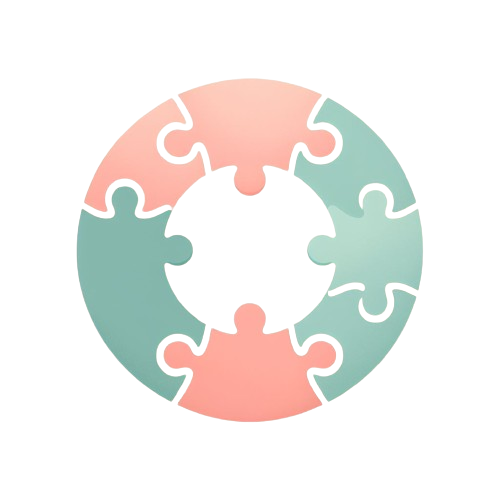
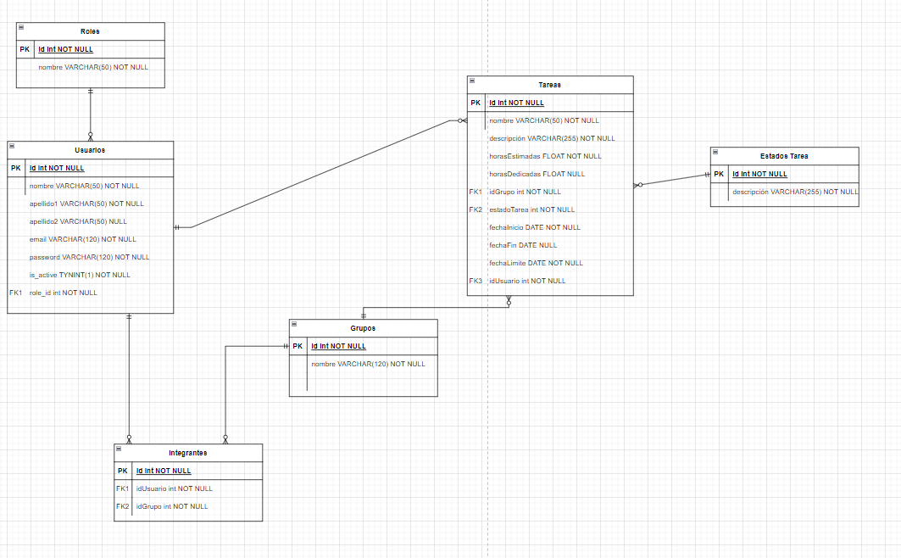

# Backend app
<div align="center">
  
</div>
<div align="center">TeamCollaborationHub</div>
<br></br>
<a href="https://www.linkedin.com/in/richard-sanz-gadea-2270101aa/" target="_blank"></a> 
<br></br>
<details>
  <summary>Contenido 📝</summary>
  <ol>
    <li><a href="#objetivo">Objetivo</a></li>
    <li><a href="#sobre-el-proyecto">Sobre el proyecto</a></li>
    <li><a href="#stack">Stack</a></li>
    <li><a href="#diagrama-bd">Diagrama</a></li>
    <li><a href="#instalación-en-local">Instalación</a></li>
    <li><a href="#endpoints">Endpoints</a></li>
    <li><a href="#mejoras">Mejoras</a></li>
    <li><a href="#licencia">Licencia</a></li>
    
  </ol>
</details>

## Objetivo
Crear una web funcional sobre una aplicación para organización y seguimiento de grupos de trabajo en un centro educativo.


## Sobre el proyecto
En este proyecto, como profesores, podemos gestionar grupos (crear,añadir/elminar alumnos, borrar y visualizar información). Como estudiantes podemos visualizar información acerca del grupo y gestionar tareas asociadas a ese grupo (crear,modificar,borrar). Y como administradores podemos gestionar tanto usuarios como grupos. 
Cada usuario dispondrá de una cuenta o perfil en el que pueda actualizar sus datos introducidos en el registro inicial.

## Stack
Tecnologías utilizadas:
<div align="center">

<a href="https://www.expressjs.com/">
    
</a>
<a href="https://nodejs.org/es/">
    
</a>
<a href="https://www.typescriptlang.org/">
    
</a>
<a href="https://www.postman.com/">
    
</a>
<a href="https://www.mysql.com/">
    
</a>
<a href="https://git-scm.com/">
    
</a>
<a href="https://www.github.com/">
    
</a>
<a href="https://jwt.io/">
    
</a>
 </div>


## Diagrama BD



## Instalación en local

<details>
<summary>⚙🔧 Instrucciones 🔧⚙</summary>

1. Clona este repositorio con el siguiente comando: `git clone [URL del repositorio]`.
2. A continuación instala todas las dependencias: `npm install `
3. Conectamos nuestro repositorio con la base de datos mediante las variables de entorno que se encuentran en el archivo .env

    ``` js
    // Environment variables
	NODE_ENV= 

   // Server configuration
	PORT=

   // Database configuration
    	DB_HOST=
    	DB_PORT=
    	DB_USER=
    	DB_PASSWORD=
    	DB_DATABASE=  

   // Secret Token
    	JWT_SECRET= ""
    ```  

4. Ejecutamos las migraciones `npx typeorm-ts-node-commonjs migration:run -d ./src/database/data-source.ts`
5. Para rellenar la tabla de datos inventados en el momento de desarrollo se puede hacer de dos maneras, una manualmente y dos con los factories, seeders y la librería faker. `npx ts-node ./src/database/seeders/dbSeeder.ts`
6. En desarrollo, lo hacemos funcionar y actualizarse en tiempo real mediante con este comando `npm run dev`
7. Para compilar usamos `npm run build`
8. En producción, con el comando `npm run start`
9. Usamos los endpoints almacenados en la carpeta routes para testear las distintas funcionalidades que se han diseñado.

</details>


## Endpoints
Los endpoints estan realizados con el puerto 4000, cambiar segun configuración

<details>
<summary>Endpoints</summary>
- ✅AUTHENTICATION

   - 🚛REGISTER USER

         POST http://localhost:4000/api/auth/register
      body:
      ``` js
            {
               "firstName":"newUser",
	            "email":"user@new.com",
	            "password":"12345678"
            }
      ```

   - 🚛LOGIN USER

         POST http://localhost:4000/api/auth/login
      body:
      ``` js
            {
               "email":"user@new.com",
	            "password":"12345678"
            }
      ```
- 🙍‍♂️USERS

   - 🚛GET PROFILE USER (Introducir token para la identificación(Auth))

      GET http://localhost:4000/api/users/profile
   
   - 🚛UPDATE PROFILE (Introducir token para la identificación(Auth))

         PUT http://localhost:4000/api/users/profile
      body:
        ``` js
        {
            "firstName": "NewUser", 
            "password": "Aa1234@",
        }
        ```
    - 🚛GET STUDENTS (Introducir token para la identificación(Auth))

        GET http://localhost:4000/api/users/students
    
    - 🚛GET ALL USERS (Introducir token para la identificación(Auth))

        GET http://localhost:4000/api/users/allUsers
    
    - 🚛GET USER BY ID (Introducir token para la identificación(Auth))

        GET http://localhost:4000/api/users/allUsers/:id

    - 🚛UPDATE USER BY ID (Introducir token para la identificación(Auth))

        PUT http://localhost:4000/api/users/allUsers/:id

        body:
        ``` js
        {
            "firstName": "NewFirstName", 
            "lastName": "NewLastName",
        }
        ```

- 👨‍👩‍👧‍👦GROUPS
    - 🚛GET GROUPS (Introducir token para la identificación(Auth))
    
        GET http://localhost:4000/api/groups/

    - 🚛GET GROUPS BY ID (Introducir token para la identificación(Auth))
    
        GET http://localhost:4000/api/groups/group/:id
    
    - 🚛CREATE GROUP(Introducir token para la identificación(Auth))
    
        POST http://localhost:4000/api/groups/create
     body:
        ``` js
        {
	        "nameGroup":"Group Team"
        }
        ```
    - 🚛UPDATE GROUP(Introducir token para la identificación(Auth))

        PUT http://localhost:4000/api/groups/:id
     body:
        ``` js
        {
	        "nameGroup":"Group Team"
        }
        ```
    - 🚛ADD USER TO GROUP (Introducir token para la identificación(Auth))

        POST http://localhost:4000/api/groups/:id/users
        body:
        ``` js
        {
	        "userId":11 
        }
        ```
    
    - 🚛DELETE USER TO GROUP (Introducir token para la identificación(Auth))

        DELETE http://localhost:4000/api/groups/:id/users
        body:
        ``` js
        {
	        "userId":11 
        }
        ```

    - 🚛GET USERS FROM GROUP (Introducir token para la identificación(Auth))

        GET http://localhost:4000/api/groups/:id/users

    - 🚛GET USERS FROM OUTSIDE THE GROUP (Introducir token para la identificación(Auth))

        GET http://localhost:4000/api/groups/:id/outUsers

    - 🚛GET ALL GROUPS (Introducir token para la identificación(Auth))

        GET http://localhost:4000/api/groups/allGroups

    - 🚛GET GROUP FROM ALL GROUPS (Introducir token para la identificación(Auth))

        GET http://localhost:4000/api/groups/allGroups/:id

    - 🚛DELETE GROUP (Introducir token para la identificación(Auth))

        DELETE http://localhost:4000/api/groups/:id

- 👨‍🎓TASKS

    - 🚛GET TASKS FROM GROUP (Introducir token para la identificación(Auth))

        GET http://localhost:4000/api/groups/:id/tasks

    - 🚛GET TASK FROM GROUP BY ID (Introducir token para la identificación(Auth))

        GET http://localhost:4000/api/groups/:id/tasks/:task

    - 🚛CREATE TASK TO THE GROUP(Introducir token para la identificación(Auth))
    
        POST http://localhost:4000/api/groups/:id/tasks
     body:

        ``` js
        {
	        "name":"TaskName",
            "description":"Do something",
            "estimatedHours":"2",
            "deadline":"2025-06-08"
        }
        ```

    - - 🚛UPDATE TASK FROM GROUP(Introducir token para la identificación(Auth))

        PUT http://localhost:4000/api/groups/:id/tasks/:task
     body:

        ``` js
        {
	        "description":"NewDescription"
        }
        ```
    
    - 🚛DELETE TASK FROM GROUP (Introducir token para la identificación(Auth))

        DELETE http://localhost:4000/api/groups/:id/tasks/:task
        
    

</details>
<br>


## Mejoras

- Implementación de envio de correo electronico

- Creación de un foro al crear un grupo (CRUD de comentarios en el foro)

## Licencia
